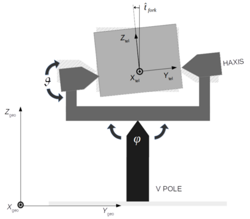
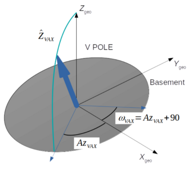

```@meta
DocTestSetup = quote
    using Stripeline
end
```

# [Pointing Reconstruction Model (PRM)](@id prm)

Starting from the scanning strategy described in [Scanning strategy](@ref scanning_strategy) we
can improve the model taking into account the non idealities of the system, parametrized by the so-called _configuration angles_.

The aim of the PRM is to calculate the pointing direction of a generic camera mounted on the STRIP
telescope, given the control angles (encoding the positions of the azimuth and altitudes motors)
as a function of time and the configuration angles describing the geometry of the telescope.

## Geometry of the telescope

First, to understand all the control angles lets analyze a model of the telescope and its 
alt-az mount. A simplified model is reported in the following figure.

```@raw html

```

A basement holds a vertical axis (V-AXIS) allowing the Azimuth rotation, a fork mounted on the
top of the V-AXIS holds the horizontal axis (H-AXIS) which allows the Altitude rotation. In an
ideal case V-AXIS and H-AXIS are perpendicular and V-AXIS is aligned with the local
(topocentric) zenith.

The rotation around the V-AXIS is performed by the _ground_ motor, while the rotation around
H-AXIS by the _altitude_ motor. There is also a _boresight_ motor that will be kept constant
and equal to zero. The position of each motor is encoded by three angles (_wheel1ang_, _wheel2ang_, _wheel3ang_)
that describe, respectively, the boresight, the altitude and the ground motor rotation.

## Configuration angles

To describe the non idealities of the telescope we need nine angles, each of which represent a rotation around
specific ($\hat{e}_x$, $\hat{e}_y$, $\hat{e}_z$) coordinate axis:

1. `wheel1ang_0`, `wheel2ang_0`, `wheel3ang_0`: 

    encode the deviation of the zero point of the telescope's motors:
    - _wheel1_ correspond to the boresight motor, and the zero point angle cause a rotation around the z-axis;
    - _wheel2_ correspond to the altitude motor, and the zero point angle cause a rotation around the y-axis;
    - _wheel3_ correspond to the ground motor, and the zero point angle cause a rotation around the z-axis.
    
2. `forkang`: 

    encodes the deviation of orthogonality between the H-AXIS and the V-AXIS;
    as reported in the figure this angles cause a rotation of the system around the x-axis.

3. `omegaVAXang`, `zVAXang`: 

    encode the deviation of the V-AXIS from the local vertical; 
    zVax is the angle between V-AXIS and the local vertical, 
    while omegaVAX is the azimuth of the ascending node (see the )

4. `panang`, `tiltang`, `rollang`: 
    
    encode the camera orientation in the telescope reference frame:
    - _pan_ is a rotation around the x-axis
    - _tilt_ is a rotation around the y-axis
    - _roll_ is a rotation around the z-axis

```@raw html
<figure>
    
    <figcaption>Fig.2 Fork angle</figcaption>
</figure>
<figure>
    
    <figcaption>Fig.3 Wobble angles</figcaption>
</figure>
```

## Pointing Reconstruction Method

PRM consist of calculate a chain of rotations to project the direction of sight of a generic camera
into the Topocentric Horizontal Reference Frame (the ground r.f. of the telescope 
see [`telescopetoground`](@ref)).

We can define the following three steps of rotations:


## Example

## Reference Documentation
```@docs
ConfigAngles
configuration_angles
telescopetoground
genpointings
```