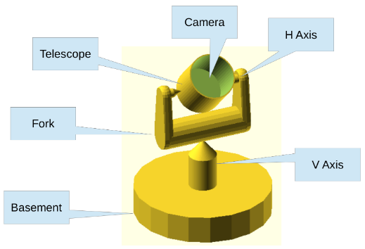

```@meta
DocTestSetup = quote
    using Stripeline
end
```

# [Pointing Reconstruction Model (PRM)](@id prm)

Starting from the scanning strategy described in [Scanning strategy](@ref scanning_strategy) we
can improve the model taking into account the non idealities of the system, parametrized by the so-called _configuration angles_.

The aim of the PRM is to calculate the pointing direction of a generic camera mounted on the STRIP
telescope, given the control angles (encoding the positions of the azimuth and altitudes motors)
as a function of time and the configuration angles describing the geometry of the telescope.

## Geometry of the telescope

First, to understand all the control angles lets analyze a model of the telescope and its 
alt-az mount. A simplified model is reported in the following figure.



A basement holds a vertical axis (V-AXIS) allowing the Azimuth rotation, a fork mounted on the
top of the V-AXIS holds the horizontal axis (H-AXIS) which allows the Altitude rotation. In an
ideal case V-AXIS and H-AXIS are perpendicular and V-AXIS is aligned with the local
(topocentric) zenith.

## Configuration angles

To describe the non idealities of the telescope we need nine angles:

- ()


```@docs
configuration_angles
```